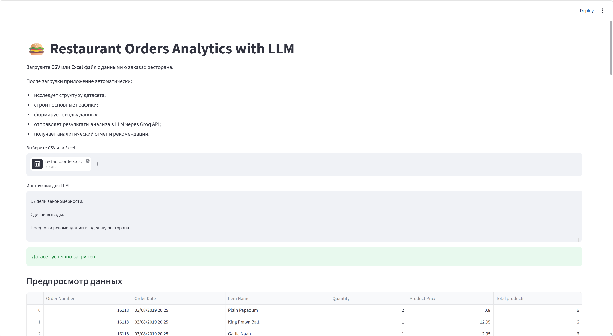
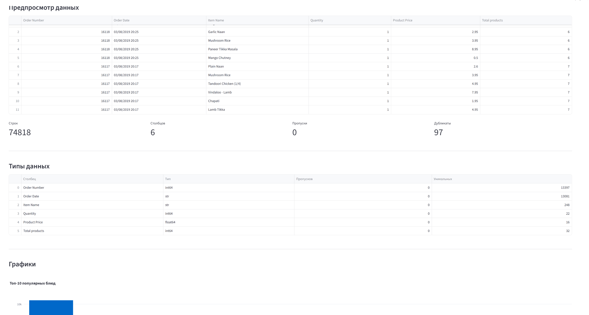
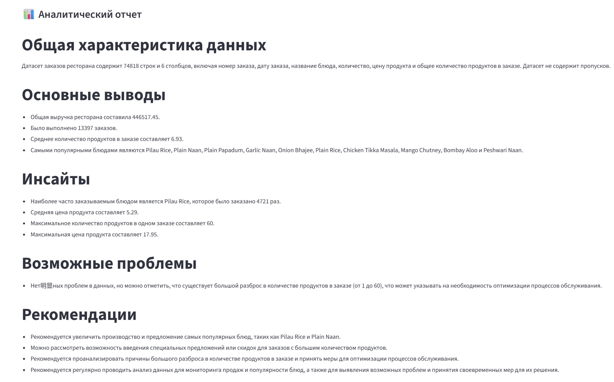

# Restaurant Orders Analytics with LLM

# Установка

1. Склонируйте репозиторий или скачайте проект.

2. Перейдите в папку проекта:

```bash
cd restaurant-orders-analytics
```

3. Установите необходимые зависимости:

```bash
pip install -r requirements.txt
```

4. Создайте файл `.env` в корневой папке проекта.

Пример содержимого:

```env
GROQ_API_KEY=your_groq_api_key
MODEL=llama-3.3-70b-versatile
```

---

# Запуск

Запустите приложение командой:

```bash
python -m streamlit run app.py
```

После запуска автоматически откроется браузер по адресу:

```
http://localhost:8501
```

---

# Использование

1. Запустите приложение.
2. Загрузите CSV или Excel-файл с данными заказов ресторана.
3. При необходимости измените инструкцию для анализа.
4. Нажмите кнопку **«Запустить LLM-анализ»**.
5. Дождитесь завершения анализа.

После выполнения анализа приложение:

- отобразит информацию о датасете;
- построит графики;
- сформирует аналитический отчёт с помощью LLM.

---

# Получение Groq API Key

1. Зарегистрируйтесь на сайте **Groq**.
2. Перейдите в раздел **API Keys**.
3. Создайте новый ключ.
4. Добавьте его в файл `.env`:

```env
GROQ_API_KEY=your_groq_api_key
```

## Описание проекта

**Restaurant Orders Analytics with LLM** — это веб-приложение для анализа данных заказов ресторана с использованием больших языковых моделей (LLM). Приложение разработано на базе **Streamlit** и использует **Groq API** для генерации аналитического отчёта по загруженному датасету.

Пользователь загружает файл с данными в формате **CSV** или **Excel**, после чего приложение автоматически исследует структуру данных, отображает основные характеристики, строит графики и формирует подробную сводку. Затем эта информация передаётся LLM, которая выполняет аналитическую обработку и формирует отчёт с выводами, найденными закономерностями и рекомендациями.

---

# Возможности

* загрузка датасета в формате CSV или Excel;
* отображение первых строк таблицы;
* просмотр структуры и характеристик датасета;
* отображение количества строк, столбцов, пропусков и дубликатов;
* построение графиков по данным;
* формирование подробной сводки о датасете;
* генерация аналитического отчёта с помощью LLM через Groq API.

---

# Используемые технологии

* Python 3
* Streamlit
* Pandas
* Plotly
* Groq API
* python-dotenv

---

# Структура проекта

```text
restaurant-orders-analytics/
│
├── app.py                 # Основной файл приложения
├── analytics.py           # Обработка данных и подготовка аналитики
├── agent.py               # Работа с Groq API
├── requirements.txt       # Зависимости проекта
├── README.md              # Документация
└── .env                   # API-ключ Groq
```

---

# Установка

Установите необходимые библиотеки:

```bash
pip install -r requirements.txt
```

---

# Настройка

Создайте в корневой папке проекта файл `.env` следующего вида:

```env
GROQ_API_KEY=your_api_key
MODEL=llama-3.3-70b-versatile
```

---

# Запуск приложения

Запустите приложение командой:

```bash
python -m streamlit run app.py
```

После запуска откроется веб-интерфейс Streamlit в браузере.

---

# Использование

1. Запустите приложение.
2. Загрузите CSV или Excel-файл с данными заказов ресторана.
3. При необходимости измените инструкцию для анализа.
4. Нажмите кнопку **«Запустить LLM-анализ»**.
5. Дождитесь завершения обработки.

После этого приложение:

* покажет основную информацию о датасете;
* построит графики;
* сформирует сводку данных;
* отправит её в LLM через Groq API;
* выведет аналитический отчёт с рекомендациями.

---

# Принцип работы

После загрузки датасета приложение автоматически:

1. считывает данные с помощью библиотеки Pandas;
2. определяет структуру датасета;
3. вычисляет основные характеристики (количество строк, столбцов, пропусков и дубликатов);
4. строит базовые графики;
5. формирует текстовую сводку с описанием данных, статистикой и ключевыми показателями;
6. передаёт эту сводку и пользовательскую инструкцию модели через Groq API;
7. получает аналитический отчёт, содержащий выводы, инсайты и рекомендации.

---

# Анализируемые показатели

Если датасет содержит соответствующие столбцы, приложение автоматически определяет:

* количество заказов;
* общую выручку;
* наиболее популярные блюда;
* статистику по числовым признакам;
* наличие пропусков и дубликатов;
* распределение заказов по датам.

---

# Входные данные

Для работы рекомендуется использовать датасет со следующими столбцами:

| Поле          | Описание            |
| ------------- | ------------------- |
| Order Number  | Номер заказа        |
| Order Date    | Дата и время заказа |
| Item Name     | Название блюда      |
| Quantity      | Количество          |
| Product Price | Цена блюда          |

Приложение также способно анализировать датасеты с дополнительными столбцами.

---

# Скриншоты

После завершения проекта можно добавить изображения интерфейса:

## Скриншот загрузки датасета



## Графики



## Аналитический отчет


